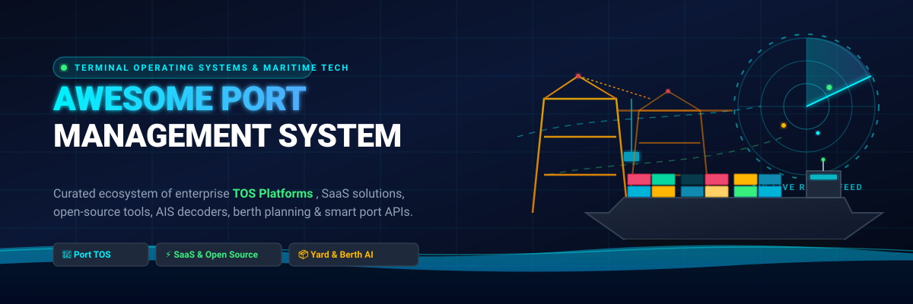

  

  
  
  
  
  
  
  

---

# 🚢 Awesome Port Management System

> **A curated directory of enterprise Terminal Operating Systems (TOS), smart port platforms, maritime logistics SaaS, AIS decoders, vessel tracking APIs, and open-source maritime software.**

Welcome to the definitive guide on **Port Management Systems (PMS)**, **Terminal Operating Systems (TOS)**, and **Maritime Logistics Technology**. This repository tracks leading commercial enterprise SaaS platforms, AI-powered berth allocation engines, drayage TMS platforms, as well as production-ready open-source maritime tools, AIS demodulators, and logistics research frameworks.

*Keywords: Port Management System, Terminal Operating System, TOS, Maritime Logistics, Vessel Planning, Yard Management, Berth Allocation, Container Terminal Automation, Smart Port, AIS Decoder, Drayage TMS.*

---

## 📑 Table of Contents

- [🌐 Market Overview & Ecosystem Dynamics](#-market-overview--ecosystem-dynamics)
- [🏢 SaaS & Commercial Hosted Platforms](#-saas--commercial-hosted-platforms)
- [💻 Open-Source GitHub Projects](#-open-source-github-projects)
- [🏗️ Open-Source Architecture Frameworks](#️-open-source-architecture-frameworks)
- [🤝 How to Contribute](#-how-to-contribute)
- [📈 Star History](#-star-history)
- [🛡️ Disclaimer](#️-disclaimer)

---

## 🌐 Market Overview & Ecosystem Dynamics

> 📊 **Estimated Sector Market Size & Industry Structure**:  
> The global Port Management System and Terminal Operating System (TOS) market is estimated at **$4.5 Billion to $7.8 Billion (2024–2026)**, expanding at a **Compound Annual Growth Rate (CAGR) of 8.6% to 10.4%**. The market exhibits a **bifurcated structure**: the core Tier-1 container Terminal Operating System segment is **moderately concentrated** with high entry barriers, mission-critical safety requirements, and entrenched market leaders (such as DP World CARGOES, Kaleris/Navis, Tideworks, and CyberLogitec); conversely, the adjacent smart port software ecosystem (including port drayage TMS, dynamic berth scheduling, predictive AIS APIs, and gate appointment optimization) is **highly fragmented** with agile specialized SaaS disruptors.

---

## 🏢 SaaS & Commercial Hosted Platforms

The table below catalogs premier commercial SaaS products and enterprise Terminal Operating Systems, ranked by **Company Size / Annual Revenue / Valuation (descending)**:

| Platform | Description & Key Capabilities | Company Size / Valuation / Revenue | Specific Pricing / Starting Tier | Free Tier / Free Trial Limits |
| :--- | :--- | :--- | :--- | :--- |
| **[CARGOES TOS+](https://www.dpworld.com/)** (DP World) | Cloud-native Terminal Operating System built by DP World for container, bulk, and multipurpose terminal operations with automated berth planning, gate appointments, and equipment dispatch. | **~$18.2 Billion Annual Revenue** (Global port logistics enterprise; valuation ~$40B+) | Starting at **$3,000/month** base software subscription for regional terminal facilities. | No free forever tier; **14-day interactive sandbox trial** on demo request with up to 10 simulated vessel calls and yard allocations. |
| **[NAVIS N4 / Octopi](https://kaleris.com/)** (Kaleris) | The global benchmark Terminal Operating System (N4) and cloud TOS (Octopi) for vessel planning, container yard management, equipment automation, and gate interchange. | **~$420 Million Acquisition Valuation** (Acquired by Thoma Bravo / Kaleris; ~$150M+ ARR) | Starting at **$2,500/month** (Octopi cloud subscription) or **$50,000/year** base tier (N4 enterprise deployment). | No free forever tier; **30-day proof-of-concept / guided sandbox trial** upon sales qualification with pre-loaded terminal test datasets. |
| **[CargoSmart / IQAX](https://www.cargosmart.com/)** | Maritime shipping visibility and port execution platform delivering real-time container milestone tracking, predictive ETA algorithms, and digital ocean documentation. | **~$300 Million Enterprise Division** (Software arm subsidiary of COSCO Shipping Group) | Starting at **$299/month** (CargoSmart Professional tier) or **$99/month** base package on CargoSmart Fleet IO. | **Free forever tier** with tracking for up to 5 active ocean shipments/month; **30-day trial** for Professional tier with up to 100 tracked Bills of Lading. |
| **[Cargomatic Port](https://www.cargomatic.com/)** | Port drayage coordination, container recovery, off-dock yard staging, and intermodal terminal visibility platform. | **~$250 Million Valuation** (~$80M+ annual revenue; backed by Warburg Pincus & Canaan Partners) | Starting at **$500/month** base platform subscription + **$25 per executed drayage container dispatch**. | No free forever tier; **14-day sandbox trial** for shippers and 3PLs with up to 10 simulated container recovery moves. |
| **[Tideworks Mainsail](https://tideworks.com/)** | Enterprise marine and rail Terminal Operating System suite (Mainsail TOS, Spinnaker planning, TrafficControl equipment management). | **~$150 Million Enterprise Unit** (Subsidiary of Carrix / SSA Marine; parent revenue ~$2B+) | Starting at **$4,000/month** (hosted SaaS tier) or **$45,000/year** base enterprise license based on annual TEU throughput. | No free forever tier; **14-day interactive sandbox trial** during technical evaluation with up to 5 concurrent user seats and simulated terminal events. |
| **[PortPro](https://portpro.io/)** | Port drayage TMS and logistics operating platform connecting drayage carriers, brokers, and marine terminals with automated dispatch, mobile driver apps, and geofencing. | **~$100 Million Valuation** (Raised $25M+ Series A/B backed by Avenue Growth & Founders Fund) | Starting at **$150/month per active driver** (includes unlimited back-office dispatch and billing user seats). | No free forever tier; **14-day live pilot trial** for verified carriers and brokers with full access to driver mobile apps and real-time port tracking. |
| **[CyberLogitec OPUS](https://www.cyberlogitec.com/)** | Enterprise container and multipurpose terminal operating system with advanced 3D yard visualization, intelligent crane dispatch, and automated gate processing. | **~$95 Million Annual Revenue** (Global maritime logistics IT solutions division of Eusu Holdings) | Starting at **$3,500/month** (cloud-hosted regional tier) or **$60,000/year** standard enterprise on-premise license. | No free forever tier; **30-day supervised staging environment trial** available for qualified port authorities and terminal operators. |
| **[INFORM Syncrotess](https://www.inform-software.com/)** | Modular AI optimization software suite for container and bulk terminals, optimizing automated stacking cranes (ASC), straddle carriers, and gate appointment flow. | **~$90 Million Annual Revenue** (~1,000+ employees; global TOS AI optimization leader) | Starting at **$2,800/month** for single-module optimization add-on (e.g., Crane Optimizer or Gate Scheduler). | No free forever tier; **30-day proof-of-concept simulation trial** using historical yard and gate dataset logs. |
| **[Portchain](https://www.portchain.com/)** | Collaborative berth planning and scheduling software facilitating Just-In-Time (JIT) vessel arrivals and berth alignment between container terminals and ocean carriers. | **~$40 Million Valuation** (Raised ~$10M+; venture-backed collaborative berth intelligence) | Starting at **$1,500/month** for container terminals with single-berth operational scope. | **Free forever tier** for ocean carriers submitting vessel schedules; **30-day pilot trial** for container terminals with up to 50 scheduled vessel calls. |
| **[TBA Group CommTrac / Autostore](https://tbagroup.com/)** | Specialized Terminal Operating System for bulk, breakbulk, and container terminals managing terminal inventory, rail links, vessel planning, and billing. | **~$35 Million Business Division** (Subsidiary of Konecranes; parent revenue ~$4.2B) | Starting at **$3,200/month** base software subscription for bulk/multipurpose facilities. | No free forever tier; **30-day guided evaluation trial** in a simulated terminal environment with preconfigured bulk/breakbulk cargo models. |
| **[Portcast](https://portcast.io/)** | Real-time container tracking, port congestion analytics, dynamic ETA predictions, and demurrage & detention avoidance software. | **~$25 Million Valuation** (Raised ~$5M+; backed by Wavemaker Partners & SGInnovate) | Starting at **$500/month** (Starter tier for up to 500 tracked containers/month). | No free forever tier; **30-day free trial** with access to the KPI analytics dashboard and tracking for up to 50 live containers. |
| **[Sinay Maritime](https://sinay.ai/)** | Port operational intelligence and environmental monitoring platform offering real-time port congestion indexes, air/water quality metrics, and maritime APIs. | **~$20 Million Valuation** (Raised ~$12M+; French maritime AI & ocean tech scale-up) | Starting at **€199/month** (~$215/month) for Developer API Pro tier (up to 10,000 monthly API calls). | **Free forever plan** with up to 500 API calls/month for ETA, Carbon Footprint, and Port Congestion APIs. |
| **[Awake.AI](https://www.awake.ai/)** | AI-driven Smart Port as a Service platform providing predictive vessel arrival (Just-In-Time), berth planning, turnaround timestamps, and port area emissions tracking. | **~$15 Million Valuation** (Raised ~$8M+ venture funding & EU Horizon maritime AI grants) | Starting at **€490/month** (~$530/month) for Smart Port starter tier targeting single-berth operators and port authorities. | **Free forever plan** supporting basic port call timestamps for up to 20 vessel calls/month; **30-day trial** with full predictive AI modules and API access. |

---

## 💻 Open-Source GitHub Projects

The following list contains prominent open-source maritime software, AIS decoders, vessel telemetry tools, and terminal prototypes, sorted by **GitHub Star Count (descending)**. Each badge directly links to the repository's stargazers page:

- **[OpenCPN](https://github.com/OpenCPN/OpenCPN)**   
  *Cross-platform shipborne chartplotter and navigation GUI supporting GPS/NMEA input, BSB/S57 raster and vector ENC charts, AIS message decoding, and waypoint autopilot routing.*

- **[AIS-catcher](https://github.com/jvde-github/AIS-catcher)**   
  *High-performance dual-channel Automatic Identification System (AIS) receiver and RF demodulator optimized for SDR hardware including RTL-SDR, Airspy, HackRF, and SDRplay.*

- **[FlightAirMap](https://github.com/Ysurac/FlightAirMap)**   
  *Open-source geospatial platform displaying live marine vessels and aircraft on interactive 2D/3D maps using AIS, ADS-B, and APRS telemetry data streams.*

- **[FlightScnr_Pi](https://github.com/yashmulgaonkar/FlightScnr_Pi)**   
  *Desktop flight and marine radar application for real-time vessel tracking and AIS traffic visualization powered by Raspberry Pi embedded displays.*

- **[Signal K Server](https://github.com/SignalK/signalk-server)**   
  *Modern open-source maritime data exchange standard and multiplexing server connecting NMEA 0183/2000, vessel sensors, and port communication interfaces.*

- **[libais](https://github.com/schwehr/libais)**   
  *High-speed C++ and Python library for parsing and decoding binary Automatic Identification System (AIS) maritime position and static data messages.*

- **[pyais](https://github.com/M0r13n/pyais)**   
  *Modern, zero-dependency Python library for decoding and encoding raw NMEA AIVDM/AIVDO maritime vessel AIS data packets.*

- **[AISmessages](https://github.com/tbsalling/aismessages)**   
  *Ultra-lightweight, zero-dependency Java message decoder for maritime navigation and safety messages compliant with ITU-R M.1371 standard.*

- **[gr-ais](https://github.com/bistromath/gr-ais)**   
  *GNU Radio block implementation for over-the-air maritime Automatic Identification System (AIS) radio packet demodulation and vessel position reporting.*

- **[Ais.Net](https://github.com/ais-dotnet/Ais.Net)**   
  *Zero-allocation, high-throughput .NET Standard AIS decoder capable of processing millions of AIVDM/AIVDO sentences per second on a single CPU core.*

- **[gnuais](https://github.com/rubund/gnuais)**   
  *Open-source C demodulator and parser for AIS marine signals received via computer soundcards or software-defined radios.*

- **[Hackerfleet HFOS](https://github.com/Hackerfleet/hfos)**   
  *Modular maritime operating system for vessel board computers, geo-information mapping, and collaborative maritime tooling.*

- **[PortManager](https://github.com/CirXe0N/PortManager)**   
  *Open-source educational prototype and simulation model for basic ship, dock, and cargo port operations management.*

---

## 🏗️ Open-Source Architecture Frameworks

Building custom port data platforms or terminal simulation environments typically relies on specialized open-source infrastructure:

- 🛰️ **AIS & Vessel Tracking Stacks**: High-throughput telemetry pipelines utilizing [libais](https://github.com/schwehr/libais), [pyais](https://github.com/M0r13n/pyais), and [AIS-catcher](https://github.com/jvde-github/AIS-catcher).
- 🗺️ **GIS & Port Geospatial Visualization**: Web mapping platforms built with QGIS, PostGIS, GeoServer, and OpenLayers for electronic nautical charts and terminal yard slot grids.
- ⚡ **Event-Driven Messaging & IoT**: Low-latency event streaming via Apache Kafka, NATS, or MQTT for quay crane telemetry, gate OCR scanners, and automated guided vehicles (AGV).
- 📐 **Mathematical Optimization Solvers**: Linear/mixed-integer programming tools (such as PuLP, OR-Tools, and SciPy) for Berth Allocation Problems (BAP) and Quay Crane Scheduling (QCSP).
- 📦 **Logistics & Resource Tracking Modules**: Adaptable open-source ERP systems (such as ERPNext and Odoo) for basic cargo manifest processing and warehouse inventory management.

---

## 🤝 How to Contribute

We welcome contributions from port operators, maritime technologists, and open-source developers!

1. 🍴 **Fork the repository**.
2. 🌿 **Create a feature branch**: `git checkout -b add-maritime-platform`.
3. 📝 **Add or update entries in `README.md`**:
   - Ensure SaaS entries include verified starting prices, company valuation/revenue data, and specific free tier/trial limits.
   - Ensure Open-Source entries include a social star badge linking to the repository stargazers page.
4. 🚀 **Submit a Pull Request** with a concise description of the addition.

---

## 📈 Star History

---

## 🛡️ Disclaimer

- This repository is a **community-curated index** provided for educational, research, and evaluation purposes.
- Port Management Systems and Terminal Operating Systems are **safety-critical and mission-critical infrastructure**. Deploying unverified or non-certified software in production terminal environments carries significant operational risk.

---

  <b>Made with 💙 for port operators, terminal managers, maritime engineers, and supply chain innovators worldwide.</b>

